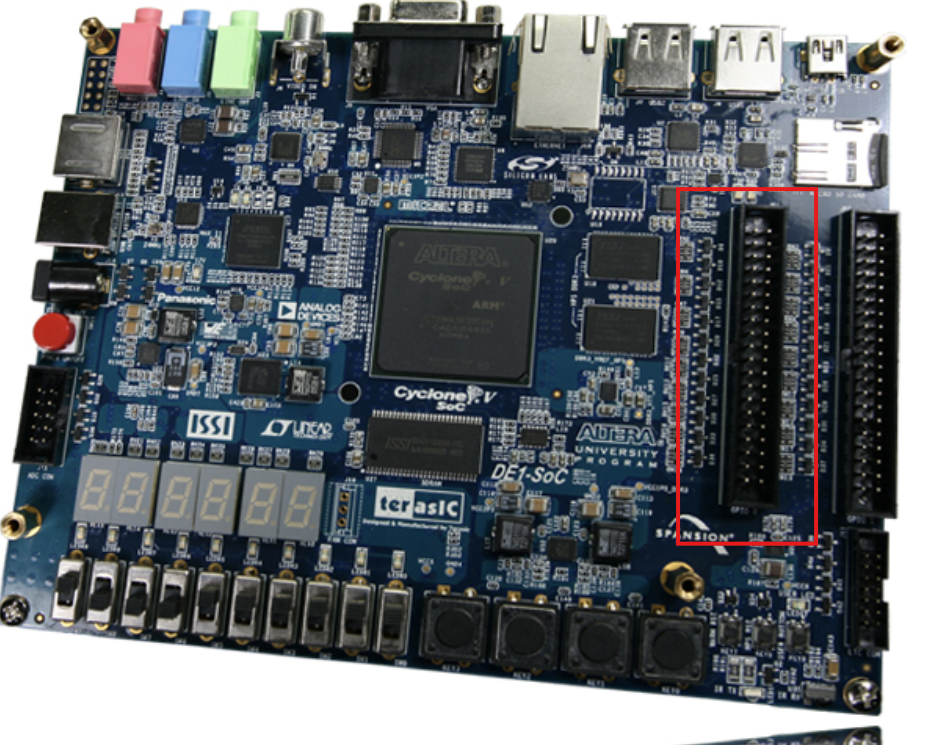
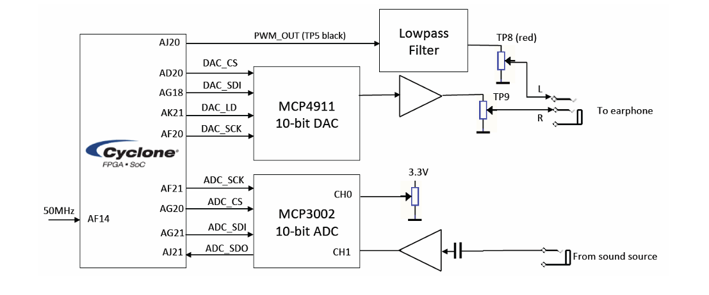
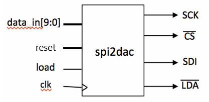
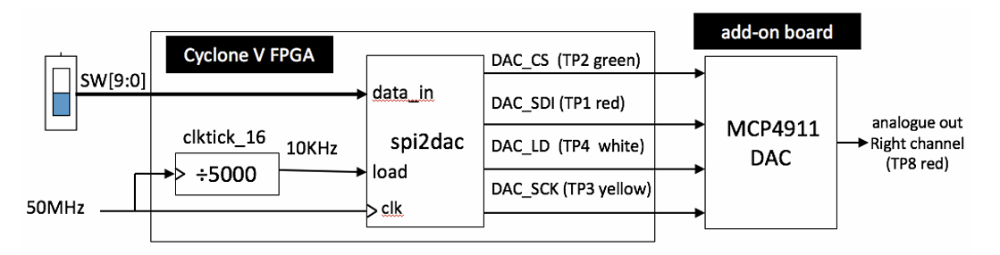
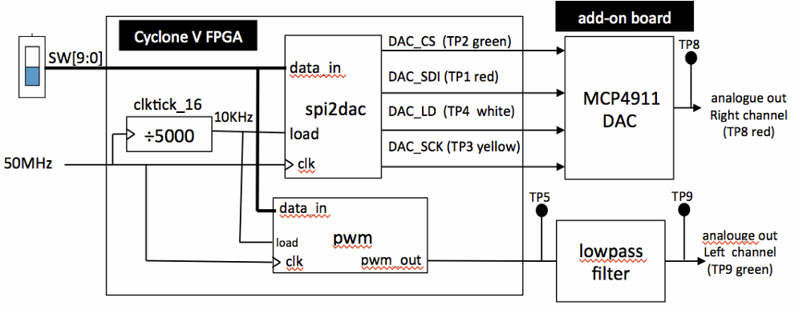
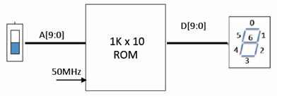
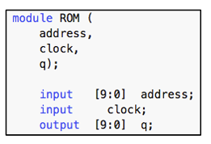
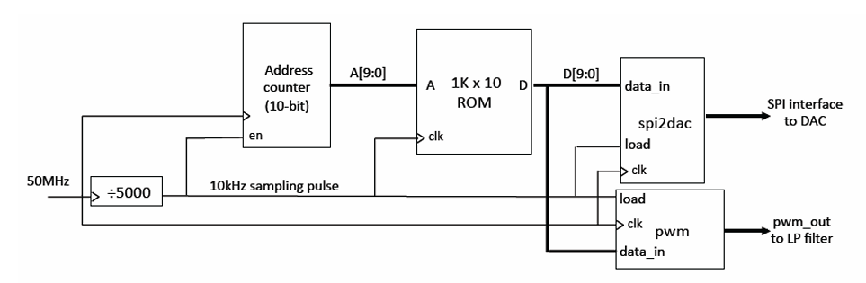
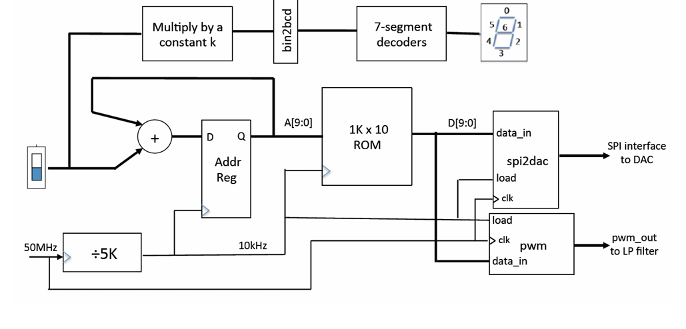

---

# Experiment Sheet - Mastering Digital Design Part 3

**Mastering Digital Design Department of EEE with Verilog on FPGAs**  
*Imperial College London*

**Version**: v6.0 - PYK Cheung, Keran Zheng, Cano Xiao, Cheng Zhang, 3 Nov 2024

**Course**: MSc Course on Analogue and Digital IC Design

## Laboratory Experiment – Mastering Digital Design (Part III)

(webpage: [www.ee.ic.ac.uk/pcheung/teaching/MSc_Experiment/](http://www.ee.ic.ac.uk/pcheung/teaching/MSc_Experiment/))

### PART 3 – Analogue I/O and SPI Serial Interface

#### 1.0 The Add-on Card

This part introduces the add-on card to the DE1 board, which includes:

- A 10-bit ADC and a 10-bit DAC
- A quad op-amp
- Sockets for earphone (analogue output) and sound source (analogue input)
- A potentiometer

The add-on card plugs into the DE1 board’s expansion socket `JP1` (closest to the FPGA chip). Ensure correct alignment; if inserted correctly, the green LED lights up when the DE1 board is turned on.


#### Required Equipment

- Personal earphones
- 3.5mm lead and a digital voltmeter (DVM)
- Oscilloscope

#### Objectives

1. Understand and verify the operation of the Serial-to-Parallel Interface (SPI) of the DAC (MCP4911) using Modelsim.
2. Test the DAC and measure its output voltage range.
3. Learn to use a ROM and a constant coefficient multiplier.
4. Use the ADC (MCP3002) to convert DC voltages.
5. Design a sinewave tone generator with variable frequency, controlled by slide switches, displaying the frequency on the 7-segment display.



---

### 2.0 Experiment 10: Interface with the MCP4911 Digital-to-Analogue Converter

1. **Understanding Datasheet**:
   - Download the [MCP4911 DAC datasheet](https://github.com/zkr12123/Lab-Module/blob/main/Lab_3/MCP49x1.pdf) and the `spi2dac.sv`, which is a Verilog module that implements the SPI interface circuit to communicate with the DAC.
   - Understand:
     - Each DAC pin's purpose (Section 3.0, page 17)
     - How information is sent to the DAC through the Serial data input (SDI) pin (Section 5.0, pages 23-24)
     - How to configure the DAC's internal function (page 25)
     - DAC timing specifications and timing diagrams (pages 4 and 7)
    - There is no need for you to know how exactly the DAC works internally.  However, you need to have sufficient appreciation of the serial interface to conduct this part of the experiment. Furthermore, don’t worry if you don’t fully understand the Verilog code in `spi2dac.sv`. This will be explained in the Lab either before or after the practical session..	

2. **Timing Diagram**:
   - The spi2dac module takes a 10-bit number in parallel (controlled through the load signal which must be high for at least 20ns) and generates the necessary serial signals to drive the MCP4911 DAC. Based on the information from the Datasheet, draw in your logbook the expected timing diagram of the SPI interface signals when a word `10’h23b` is sent to the DAC.

   

3. **Verify Timing of `spi2dac.sv` Using Modelsim**:
    1. Create a project ex10 and a top-level module `ex10_top.sv`
    2. Copy to the directory ex10 the file `spi2dac.sv` downloaded from the webpage
    3. Make this file top-level module (for now)
    4. Click: … > Process > Start > Analyze and Synthesise
    5. Start Modelsim (Tools > Run Simulation Tools > RTL Simulation)
    6. Design a do-file as a testbench to exercise the input signals correctly
    7. Remember to set the `reset` signal in your simulation test bench
    8. Run the do-file and match the waveform generated with your prediction

   **spi2dac reset**:
   - The rest signal is explicitly added to the SystemVerilog-version of the `spi2dac` module (previous `spi2dac.v` uses `initial` statement) as Modelsim does not allow using `initial` statement to assign to a reg state which will be modified in an `always_ff` procedural statement. It is therefore important to add a reset signal to force the module into a "known" state at the start of the simulation.
   - In synthesis and implementation you can either choose to assign the `reset` signal to `KEY[0]` (remember `KEY[0]` is active low) or ignore it (not assigning anything to `reset`) as the output don't care about its internal counter state.

4. **Testing the DAC on DE1**:
   - Implement `ex10_top.sv`, connecting modules as shown in the diagram.
   - The data_in value determined by the 10 switches `(SW[9:0])` is loaded to the `spi2dac` module at a rate of 10k samples per second as governed by the `load` signal. The steps for this part are:
        1. Download from the experiment website the file `spi2dac.sv`.
        2. Check that the `clktick_16.sv` module that you used last week is in the “mylib” folder.
        3. Create a top-level module `ex10_top.sv` to connect all modules together as shown in the diagram.
        4. Click: `Project > Add/Remove Files in Project …`, and select all the relevant files used here. This step is important – it allows you to select which modules to include in your design.
        5. When `ex10_top.sv` is the current file, click: `Project > Set as Top-Level Entity`. This is another useful step, which defines the top module, and all those modules below this one, for compilation. With steps 4 and 5, you can move up or down the design hierarchy in a project for compilation.
        6. Edit the `ex10_top.qsf` file to include `pin_assignment.txt`.
        7. Compile and correct errors as necessary.

   - Measure DAC output voltage at TP8 with `SW[9:0] = 0` and `10'h3ff`.  (The voltage range of the DAC output should be from 0V to 3.3V.) 
   

5. **Verify Signals with an Oscilloscope**:
   - Confirm that the signals produced by the FPGA with the `spi2dac.sv` module agree with those from Modelsim. Set `SW[9:0]` to `10’h23b` and measure `DAC_SCK`(TP3) and `DAC_SDI`(TP1) using an oscilloscope.  You may need to trigger the scope externally with the `DAC_CS` signal(TP2). Compare the waveforms to those predicted by Modelsim. (There are two scopes in the 909 Lab for you to borrow for this part of the Lab.)

---

### 3.0 Experiment 11: D-to-A Conversion Using Pulse-Width Modulation
Instead of using a DAC chip (and SPI serial interface to communicate with the chip), an alternative method to produce an analogue output from a digital number is to use pulsewidth modulation (PWM). The Verilog code for a `pwm.sv` module is given to you in one of my lectures delivered earlier in the Lab..
1. Use `pwm.sv` Verilog code for PWM-based DAC.
2. Create `ex11_top.sv` and examine signals at TP5 and TP8.
3. Compare voltage ranges at TP8 and TP9.


---

### 4.0 Experiment 12: Designing and Testing a Sinewave Table in ROM
This part of the experiment leads you through the design of a 1K x 10 bit ROM, which stores a table of sine values suitable to drive our DAC. The relationship between the content of the ROM `D[9:0]` and its address `A[9:0]` is:
```
D[9:0] = int(511*sin(A[9:0]*2*pi/1024)+512) for 1023 ≥ A[9:0] ≥ 0
```
Since the DAC accepts an input range of 0 to 1023, we must add an offset of 512 in this equation. (This number representation is known as **off-set binary code**.)

Before generating the ROM in Quartus using the **Memory Compiler** tool, we need to first create a text file specifying the contents of the ROM. This can be done in different ways. Included on the [Experiment webpage](https://github.com/zkr12123/Lab-Module/tree/main/Lab_3) are:
1. A Python script to do this
2. A Matlab script to do the same thing
3. A memory initialization file [`rom_data.mif`](https://github.com/zkr12123/Lab-Module/blob/main/Lab_3/rom_data.mif) created by either method

Download these files and examine them.

Click `Tools > IP Catalog` to bring up a tool which helps to create a 1-Port ROM. A catalog window will pop up. Select from the window `Library > Basic Functions > Onchip Memory > ROM 1-Port`. Complete the on-screen form to create `ROM.v`.

To verify the ROM, create the design `ex12_top.sv`, that uses the switches `SW[9:0]` to specify the address to the ROM, and display the contents stored at the specified location on the four 7-segment display. Once this is done and loaded onto the DE1, verify that the contents stored in the ROM match those specified in the `rom_data.mif` file.




---

### 5.0 Experiment 13: A Fixed Frequency Sinewave Generator
Let us now replace the slide switches with a 10-bit binary counter and connect the ROM data output to `spi2dac` and `pwm` modules as shown in the figure below. Since the ROM contains one cycle of sinewave and the address to the ROM is incremented every cycle of the 10kHz clock, a perfect sinewave is produced at the left and right outputs of the 3.5mm jack socket.
1. Combine components to create `ex14_top.sv`
2. Implement this circuit and verify that the signals produced by both the DAC and the PWM are as expected.
3. What is the frequency of the sinewave? 


---

### 6.0 Experiment 14: A Variable Sinewave Generator

Combine everything together to produce a design `ex14_top.sv`, which produces a variable frequency sinewave using table-lookup method. The sampling frequency is 10kHz, and the sine value is read from the ROM that is preloaded with one-cycle of a sinewave (i.e. the address of the ROM is the phase and the content is the sine value). On every sample period, advance the address (i.e. the phase) by an amount determined by `SW[9:0]`. Derive the relationship between the output signal frequency and the switch setting. 

The overall block diagram is shown below. The switch setting is multiplied by a constant k to 
convert the phase increment `SW[9:0]` to frequency. 


You can produce a 10-bit x 14-bit constant coefficient multiplier using the IP catalog tool. The 14-bit constant is `14’h2710` (which is `14’d10000`). The product is a 24-bit number, and the frequency is the top 14-bits (Why?). The frequency can then be displayed on the 7-segment displays.   

Produce a 439Hz sinewave, which is close to 440Hz, the frequency commonly found in 
tuning forks. Make sure that this is indeed correct (through listening or measuring with a 
frequency counter). 


**Solution File**:
   - To help you know what you should aim for, the solutions for [`ex14sol.sof`](https://github.com/zkr12123/Lab-Module/blob/main/Lab_3/ex14sol.sof.zip) is available to download.   

---